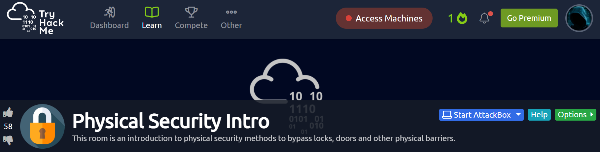

# TryHackMe
  https://tryhackme.com/room/physicalsecurityintro
  

        
# Task 1  Introduction

Learn the basics of physical security

A lot of times physical security is overlooked during red team engagements.
 
Sure, it's not as popular as cyber security, however having some basic knowledge of
lock picking and bypasses are an important tool to have in your repertoire.
Below are some great videos that are a perfect introduction to physical security. 
If you have a basic knowledge of physical security already, you might be able to 
breeze through the room, however if you don't, these videos will be one of the best
introductions you could get.

I'll Let Myself In: Tactics of Physical Pen Testers - Deviant Ollam
  https://youtu.be/rnmcRTnTNC8
  
The Right Way To Do Wrong - Patrick McNeil
  https://youtu.be/sw94smSiJBY
  
  `Watched the videos`
  
# Task 2  Overt, Covert, and Surreptitious Entry

    
